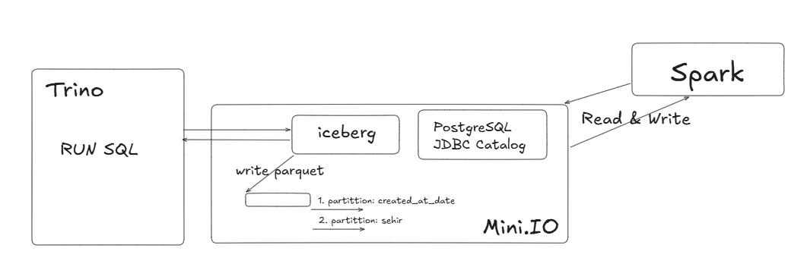

# Local Data Lakehouse Kurulumu: Spark, Iceberg, Trino ve MinIO

Bu doküman, Docker üzerinde çalışan yerel bir Data Lakehouse mimarisi kurar. Apache Iceberg tablo formatı kullanılmakta olup, metadata yönetimi için **JDBC Catalog** ve dosya depolama için **MinIO ** yapılandırılmıştır. Ayrıca tabloda **2 aşamalı partitioning** uygulanmıştır.


 

## 1. Proje Dizin Yapısı

Dosyaları oluşturmadan önce aşağıdaki klasör yapısını hazırladığınızdan emin olun. Trino konfigürasyon dosyaları bu yapıda olmalıdır.

```text
.
├── docker-compose.yml
├── pyspark/
└── trino/
    └── etc/
        ├── config.properties
        ├── jvm.config
        ├── node.properties
        └── catalog/
            └── iceberg.properties

```

---

## 2. Altyapı Kurulumu (docker-compose.yml)

Ana servisleri (MinIO, PostgreSQL, PySpark, Trino) ayağa kaldıran yapılandırma dosyasıdır.

**Dosya:** `docker-compose.yml`

```yaml
version: '3.8'

services:
  minio:
    image: minio/minio
    container_name: minio
    ports:
      - "9000:9000" 
      - "9001:9001"
    environment:
      MINIO_ROOT_USER: minioadmin
      MINIO_ROOT_PASSWORD: minioadmin
    command: server /data --console-address ":9001"
    networks:
      - ice-net

  postgres:
    image: postgres:15
    container_name: postgres
    environment:
      POSTGRES_USER: admin
      POSTGRES_PASSWORD: password
      POSTGRES_DB: iceberg_catalog
    ports:
      - "5432:5432"
    networks:
      - ice-net

  pyspark:
    image: jupyter/pyspark-notebook:latest
    container_name: pyspark
    environment:
      JUPYTER_ENABLE_LAB: "yes"
    command: ["start-notebook.sh", "--NotebookApp.token='123'", "--NotebookApp.password=''"]
    ports:
      - "8888:8888"
    volumes:
      - ./pyspark:/home/jovyan/work
    networks:
      - ice-net
    depends_on:
      - minio
      - postgres

  trino:
    image: trinodb/trino:latest
    container_name: trino
    ports:
      - "8080:8080"
    volumes:
      - ./trino/etc:/etc/trino 
    networks:
      - ice-net
    depends_on:
      - minio
      - postgres

networks:
  ice-net:

```

---

## 3. Trino Konfigürasyon Dosyaları

Trino'nun Iceberg kataloğunu tanıması ve PostgreSQL/MinIO ile konuşabilmesi için gerekli ayarlar.

**Dosya:** `trino/etc/catalog/iceberg.properties`

```properties
connector.name=iceberg

# --- JDBC Catalog Ayarları ---
iceberg.catalog.type=jdbc
iceberg.jdbc-catalog.driver-class=org.postgresql.Driver
iceberg.jdbc-catalog.connection-url=jdbc:postgresql://postgres:5432/iceberg_catalog
iceberg.jdbc-catalog.connection-user=admin
iceberg.jdbc-catalog.connection-password=password
iceberg.jdbc-catalog.catalog-name=iceberg

# Verilerin varsayılan olarak yazılacağı kök dizin
iceberg.jdbc-catalog.default-warehouse-dir=s3a://warehouse/

# --- MinIO (S3) Ayarları ---
fs.native-s3.enabled=true
s3.endpoint=http://minio:9000
s3.region=us-east-1
s3.aws-access-key=minioadmin
s3.aws-secret-key=minioadmin
s3.path-style-access=true

```

**Dosya:** `trino/etc/config.properties`

```properties
coordinator=true
node-scheduler.include-coordinator=true
http-server.http.port=8080
query.max-memory=1GB
query.max-memory-per-node=512MB
discovery.uri=http://localhost:8080

```

**Dosya:** `trino/etc/jvm.config`

```properties
-server
-Xmx1G
-XX:+UseG1GC
-XX:G1HeapRegionSize=32M
-XX:+UseGCOverheadLimit
-XX:+ExplicitGCInvokesConcurrent
-XX:+HeapDumpOnOutOfMemoryError
-XX:OnOutOfMemoryError=kill -9 %p

```

**Dosya:** `trino/etc/node.properties`

```properties
node.environment=production
node.id=ffffffff-ffff-ffff-ffff-ffffffffffff
node.data-dir=/data/trino

```

---

## 4. Servisleri Başlatma ve Hazırlık

1. **Containerları Başlatın:**
Terminalde `docker-compose.yml` dosyasının olduğu dizinde şu komutu çalıştırın:
```bash
docker-compose up -d

```


2. **MinIO Bucket Oluşturma:**
* Tarayıcıdan [http://localhost:9001](http://localhost:9001) adresine gidin.
* **Kullanıcı:** `minioadmin` / **Şifre:** `minioadmin`
* Sol menüden **Buckets** kısmına tıklayın.
* **Create Bucket** butonuna basarak `warehouse` isminde bir bucket oluşturun.


---

## 5. Spark ile Veri Yazma (Python)

Bu adımda Spark, PostgreSQL'i (Catalog) ve MinIO'yu (Warehouse) kullanarak Iceberg formatında veri yazar. Tablo `created_at_date` ve `sehir` kolonlarına göre **partitioned** olarak oluşturulur.

Jupyter Lab'e (`http://localhost:8888` - Token: `123`) girip yeni bir notebook açarak aşağıdaki kodu çalıştırın:

```python
import pyspark
from pyspark.sql import SparkSession
from datetime import date, datetime

iceberg_version = "1.5.0"
spark_major_version = "3.5"

packages = [
    f"org.apache.iceberg:iceberg-spark-runtime-{spark_major_version}_2.12:{iceberg_version}",
    "org.apache.hadoop:hadoop-aws:3.3.4",
    "org.postgresql:postgresql:42.6.0"
]

spark = SparkSession.builder \
    .appName("Iceberg Local Dev") \
    .config("spark.jars.packages", ",".join(packages)) \
    .config("spark.sql.extensions", "org.apache.iceberg.spark.extensions.IcebergSparkSessionExtensions") \
    .config("spark.sql.catalog.iceberg", "org.apache.iceberg.spark.SparkCatalog") \
    .config("spark.sql.catalog.iceberg.type", "jdbc") \
    .config("spark.sql.catalog.iceberg.uri", "jdbc:postgresql://postgres:5432/iceberg_catalog") \
    .config("spark.sql.catalog.iceberg.jdbc.user", "admin") \
    .config("spark.sql.catalog.iceberg.jdbc.password", "password") \
    .config("spark.sql.catalog.iceberg.jdbc.schema-version", "V1") \
    .config("spark.sql.catalog.iceberg.warehouse", "s3a://warehouse/iceberg_data") \
    .config("spark.hadoop.fs.s3a.endpoint", "http://minio:9000") \
    .config("spark.hadoop.fs.s3a.access.key", "minioadmin") \
    .config("spark.hadoop.fs.s3a.secret.key", "minioadmin") \
    .config("spark.hadoop.fs.s3a.path.style.access", "true") \
    .config("spark.hadoop.fs.s3a.impl", "org.apache.hadoop.fs.s3a.S3AFileSystem") \
    .config("spark.hadoop.fs.s3a.connection.ssl.enabled", "false") \
    .getOrCreate()


# 1. Namespace
spark.sql("CREATE NAMESPACE IF NOT EXISTS iceberg.db")

spark.sql("DROP TABLE IF EXISTS iceberg.db.musteriler_v2")

# Çift Partition
spark.sql("""
CREATE TABLE iceberg.db.musteriler_v2 (
    id bigint,
    isim string,
    sehir string,
    tutar double,
    created_at_date date,
    islem_zamani timestamp
) USING iceberg
PARTITIONED BY (created_at_date, sehir)
""")

data = [
    (101, "Ali", "Istanbul", 150.0, date(2024, 1, 1), datetime.now()),
    (102, "Veli", "Izmir", 200.0, date(2024, 1, 2), datetime.now())
]
df = spark.createDataFrame(data, ["id", "isim", "sehir", "tutar", "created_at_date", "islem_zamani"])

df.writeTo("iceberg.db.musteriler_v2").append()

print("Veri yazma işlemi tamamlandı.")
spark.sql("SELECT * FROM iceberg.db.musteriler_v2").show()

```

---

## 6. Trino ile Doğrulama

Spark ile yazılan veriyi Trino CLI üzerinden sorgulayarak teyit ediyoruz.

1. **Trino CLI'a bağlanın:**
```bash
docker exec -it trino trino

```


2. **Sorguyu çalıştırın:**
```sql
SELECT * FROM iceberg.db.musteriler_v2;

```


3. **Beklenen Çıktı:**
```text
 id  | isim |  sehir   | tutar | created_at_date |         islem_zamani
-----+------+----------+-------+-----------------+--------------------------------
 101 | Ali  | Istanbul | 150.0 | 2024-01-01      | 2026-01-04 11:05:17.906372 UTC
 102 | Veli | Izmir    | 200.0 | 2024-01-02      | 2026-01-04 11:05:17.906376 UTC
(2 rows)

```